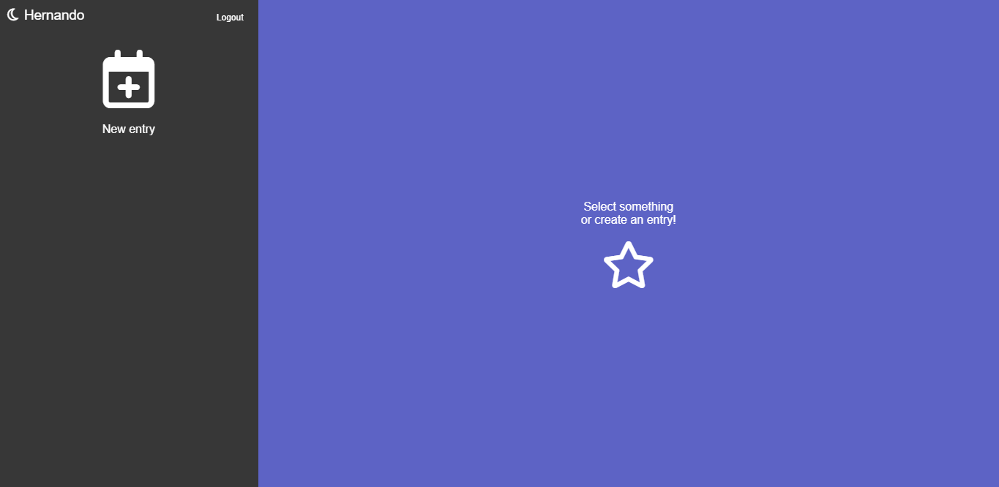
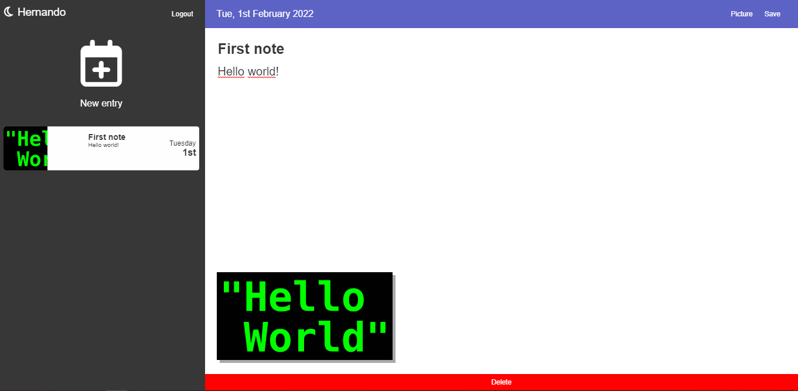

    <h1>Journal App</h1>
    
    

Journal App created with ReactJS for the Fernando Herrera's Udemy course ( [React: De cero a experto (Hooks y Mern)](https://www.udemy.com/course/react-cero-experto/) ).

[CHECK THE WEBSITE](https://ferbuono.github.io/journal-app/)

## Table of Contents

* [Project overview](#project-overview)

* [Screenshots](#screenshots)

* [Technologies](#technologies)

* [Pending...](#pending)

## Project overview

The project is based on a journal where you can upload your fully detailed notes along with an image. 

It implements the CRUD pattern, so you can edit your notes and even delete them.

Firebase is used as the authentication method and database to store the notes of each user. Images are stored in cloudinary.

Enzyme was used to perform the testing of the different components and functionalities.

	
## Screenshots

## Technologies

### Main libraries used in the project

| Technology                                                       | Used for                  |
| ---------------------------------------------------------------- | ------------------------- |
| [ReactJs](https://es.reactjs.org/)                               | JavaScript framework      |
| [React Redux](https://react-redux.js.org/)                       | States management         |
| [React Router](https://reactrouter.com/)                         | Router                    |
| [Firebase](https://firebase.google.com/?hl=es)                   | Authentication & DataBase |
| [Cloudinary](https://cloudinary.com/)                            | Images storage            |
| [Enzyme](https://enzymejs.github.io/enzyme/)                     | Testing                   |
| [ValidatorJS](https://www.npmjs.com/package/validatorjs)         | Email validation          |
| [SASS](https://sass-lang.com/)                                   | Styling                   |
| [Moment](https://momentjs.com/)                                  | Date formatting           |
| [SweetAlert2](https://sweetalert2.github.io/)                    | Pop-up alerts             |

	
## Pending...

Pending tasks:
- [ ] Responsiveness
- [ ] Styling
